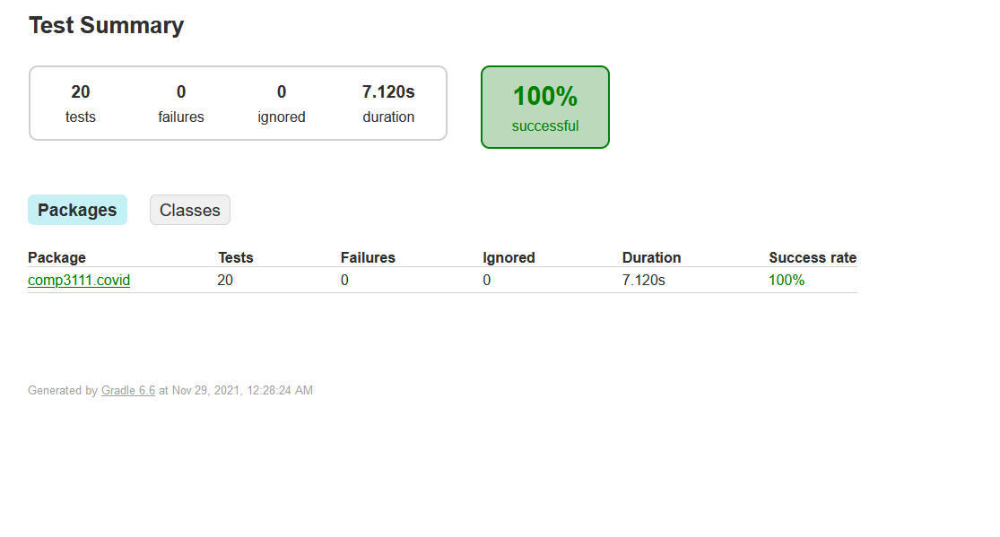
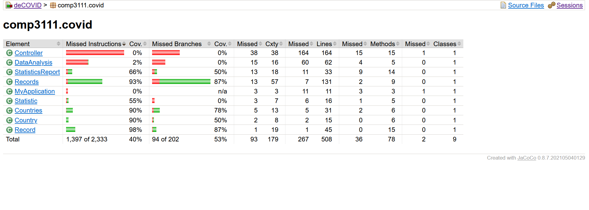

#T-28
https://github.com/SamuraiLee0513007/T28-Project-COMP3111
1. Lee Cheuk Yin, Ivan  
    email:cyleeax | github:SamuraiLee0513007|  
    dev branch:samurai_1  
    Individual task assignment: Task C1 & Task C2
2. Ho Wing Yiu, Ryan 
    email:wyhoap | github:vzryanho|  
    dev branch:nk_feature1_ryan_lab
    Individual task assignment: Task A1 & Task A2
3. Pang Lok Chi, Lok  
	email:lcpang | github:panglokchi|  
	dev branch:nk_feature1_lok  
	Individual task assignment: Task B1 & Task B2
	
For screenshots and documentation

Test results:

Coverage results:

Note: not counting UI(Controller.java), branch coverage is 65.8%.

Javadoc:
[Here](https://panglokchi.github.io/comp3111_javadoc/doc/comp3111/covid/package-summary.html)

Screenshots:
[notes.docx](./notes.docx)
